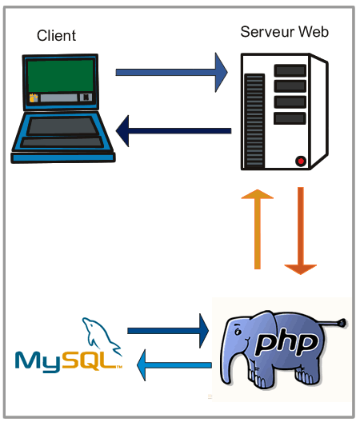

# Découverte de php

## Tester deux formulaires sur un serveur du lycée
* [Formulaire.html](http://10.10.20.25/Questionnaire/Formulaire.html)
* [Formulaire.php](http://10.10.20.25/Questionnaire/Formulaire.php)

## Un exemple de fichier php
* A copier dans `C:\xampp\htdocs\Questionnaire\`
* [Formulaire.php](Formulaire.php)

